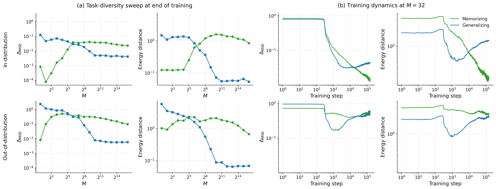

# BFT-PMC

Research code for *What does a Bayes-filtered transformer believe? A predictive
Monte Carlo approach*.

A Bayes-filtered transformer (BFT) is trained on sequences generated by first
drawing a latent task from a prior and then drawing observations conditional on
that task. Predictive Monte Carlo (PMC) uses next-token generation to recover an
approximation to the transformer's implicit prior and posterior over the latent
task. This repository applies PMC to task-diversity and training-dynamics
experiments in three stylized BFT families:

- linear regression with finite Gaussian weight pools;
- balls and urns with finite Dirichlet task pools;
- finite-state Markov chains.

The first two are exchangeable prior-fitted network (PFN) settings; the third
extends the same analysis to 1-Markov exchangeability.



*Linear-regression task-diversity sweep (left) and training dynamics at
`M = 32` (right). Green and blue measure agreement with memorising and
generalising Bayesian references.*

The repository includes the aggregate metrics and evaluation datasets required
to regenerate the aggregate paper figures produced by
`scripts/reproduce_paper.sh`, without downloading checkpoints or using a GPU.
Training and checkpoint-based evaluation code is included for full reruns.

## Installation

Python 3.13 or newer is required. The supported environment manager is
[`uv`](https://docs.astral.sh/uv/).

```bash
git clone https://github.com/afiq-aswadi/bft-pmc.git
cd bft-pmc
uv sync
```

The PFN library is vendored under `pfn_transformers/` and installed as an
editable local dependency. No submodule setup is required.

Weights & Biases logging is disabled by default. Set `WANDB_PROJECT` and
`WANDB_ENTITY` in your environment and pass `--use-wandb` when enabling it. The
paper-figure reproduction path does not contact W&B or require network access.

## Hardware and runtime

Figure reproduction from the frozen metrics is CPU-only and does not load
checkpoints. The 10-step commands below are small API smoke tests, not
scientifically meaningful training runs, and can run without a CUDA GPU.

The full paper sweeps are GPU workloads and produce long-running training jobs.
Model checkpoints and precomputed PMC sample bundles are too large for this
source repository and are not committed. Neither is needed for the bundled
aggregate-figure reproduction path; the repository includes the code to
regenerate the bundles from checkpoints.

## Reproduce the bundled aggregate figures

```bash
bash scripts/reproduce_paper.sh
```

Figures are written to `outputs/paper_reproduction/`. Override the destination
without modifying the script:

```bash
OUTPUT_ROOT=/tmp/bft-pmc-paper-figures bash scripts/reproduce_paper.sh
```

For the current manuscript, the script regenerates the aggregate LR,
balls-and-urns, and Markov task-diversity and training-dynamics panels in
Figures 4, 8-9, 11-12, and 14-15, including the paper-ready 2-by-2 variants and
prior-only panels.

It does not render the schematic, identifiability, or attention-mask figures,
the Beta-Bernoulli grid, or the sample-based marginal figures. The
Beta-Bernoulli experiment has a separate entry point below. Distribution
marginals require generated PMC sample bundles; the generation and plotting
commands are documented in
[`paper_data/README.md`](paper_data/README.md#generate-sample-bundles-for-marginal-plots).
See the same document for individual aggregate-figure commands.

Every paper figure, its generator (in the public layout), its inputs, and
where those inputs live are catalogued in
[`paper_data/FIGURE_PROVENANCE.md`](paper_data/FIGURE_PROVENANCE.md); consult it
together with `scripts/reproduce_paper.sh` when regenerating figures.

## Quick training smoke runs

The unified training entry point dispatches to each task family:

```bash
uv run train.py lr --num-tasks 32 --num-steps 10 --batch-size 8 --seq-len 16 --no-use-wandb
uv run train.py bau --num-tasks 32 --num-steps 10 --batch-size 8 --seq-len 16 --no-use-wandb
uv run train.py markov --config-path markov/train.yaml --n-chains 32 --max-steps 10 --no-use-wandb
```

The continuous-prior Beta-Bernoulli experiment introduced in Figure 1 and
detailed in Appendix E is available as a separate training-and-PMC entry point.
Its defaults match the paper configuration and save the final checkpoint, PMC
samples, and the Figure 5 grid below `outputs/bau/beta_bernoulli/`:

```bash
uv run train.py beta-bernoulli
```

To rerun only PMC and plotting from an existing checkpoint, pass
`--checkpoint-path path/to/checkpoint.pt`. To regenerate the Beta-Bernoulli
grid from the committed samples without training, pass
`--replot-from paper_data/beta_bernoulli/pmc_samples.npz`.

The paper runs use a fixed random seed of 42 for the three main task families
(linear regression, balls-and-urns, and Markov) and 0 for the Beta-Bernoulli
experiment.

Use `uv run train.py --help` or place `--help` after a task family for the full
CLI. The paper sweeps are defined by reviewable YAML files:

```bash
uv run sweeps/run_yaml_sweep.py sweeps/configs/lr_task_diversity_sweep.yaml --dry-run
uv run sweeps/run_yaml_sweep.py sweeps/configs/bau_task_diversity_sweep.yaml --dry-run
uv run sweeps/run_yaml_sweep.py sweeps/configs/markov_task_diversity_sweep.yaml --dry-run
```

These are the three sweeps used for the paper's task-diversity figures. The
training-dynamics figures reuse all saved checkpoints from the `M=32` linear
regression and balls-and-urns runs and the `M=8` Markov run, so they do not need
separate sweep configurations.

Remove `--dry-run` to launch a sweep. Outputs and checkpoints are ignored by
git and are written below `outputs/` and `checkpoints/`.

## Evaluation entry points

`eval.py` is the public dispatcher for checkpoint evaluation and the main
aggregate figures.

| Command | Purpose |
| --- | --- |
| `uv run eval.py lr-sweep ...` | Evaluate an LR checkpoint sweep |
| `uv run eval.py bau-sweep ...` | Evaluate a balls-and-urns checkpoint sweep |
| `uv run eval.py markov-sweep ...` | Evaluate a Markov checkpoint sweep |
| `uv run eval.py markov-threshold ...` | Run the Markov task-diversity threshold experiment |
| `uv run eval.py plot-lr-sweep ...` | Plot the LR task-diversity sweep |
| `uv run eval.py plot-lr-dynamics ...` | Plot LR training dynamics |
| `uv run eval.py plot-bau-sweep ...` | Plot the balls-and-urns sweep |
| `uv run eval.py plot-bau-dynamics ...` | Plot balls-and-urns training dynamics |
| `uv run eval.py plot-markov-sweep ...` | Plot the Markov task-diversity sweep |
| `uv run eval.py plot-markov-dynamics ...` | Plot Markov training dynamics |

The lower-level plotters live with their task family. In particular, each
family has one canonical aggregate sweep plotter, one dynamics plotter, and one
prior-only plotter. Marginal-grid and stitched-marginal variants share the
rendering primitives in `plotting/marginal_cell.py`; they are separate entry
points because they produce different paper layouts, not forked implementations.

## Frozen artifacts

`paper_data/` contains:

- aggregate `metrics.csv` files used by the figure scripts;
- raw per-prompt metric tables behind those aggregates;
- fixed LR and balls-and-urns evaluation datasets;
- committed Markov KL-history CSVs originally exported from W&B;
- the exact experiment configurations associated with each snapshot.

Generated PNG and PDF files are intentionally not tracked. The local
`paper_data/.gitignore` explicitly re-includes CSV and NPZ files so a fresh
repository created on a machine with a global data-file ignore still retains
the reproducibility assets.

Precomputed Predictive Monte Carlo sample bundles and model checkpoints are too
large for the repository. The code to generate the sample bundles is included;
their generation commands, expected layouts, fields, and plotting commands are
documented in
[`paper_data/README.md`](paper_data/README.md#generate-sample-bundles-for-marginal-plots).
Checkpoint layouts are documented in [`MODEL_ZOO.md`](MODEL_ZOO.md).

## Repository layout

```text
analysis/                 checkpoint helpers shared across task families
assets/                   curated README figure
balls_and_urns/           balls-and-urns training, evaluation, and figures
linear_regression/        LR training, evaluation, and figures
markov/                   Markov training, evaluation, and figures
plotting/                 shared marginal-cell rendering primitives
pfn_transformers/         vendored PFN TransformerLens library and its tests
scripts/                  reproduction and frozen-data preparation utilities
sweeps/                   YAML sweep launcher and checked-in sweep definitions
paper_data/               frozen figure inputs and evaluation data
train.py                  unified training dispatcher
eval.py                   unified evaluation and plotting dispatcher
metrics.py                shared distribution metrics
```

## Tests and coverage

```bash
uv run pytest
```

The test command enforces 100% line coverage for maintained Python code. Tests
and cookbook examples are excluded from the coverage denominator; public
packages, command dispatchers, and scripts are included. The XML report is
written to `coverage.xml`.

## License

The repository, including the vendored `pfn_transformers/` snapshot, is
released under the MIT License. See [`LICENSE`](LICENSE).

## Supplementary figures

`icl2_supplementary.pdf` collects the complete set of PMC-recovered marginal densities and CDFs for all three task families across every task diversity. The paper shows a representative subset; the full set lives here to keep the arXiv submission compilable.
